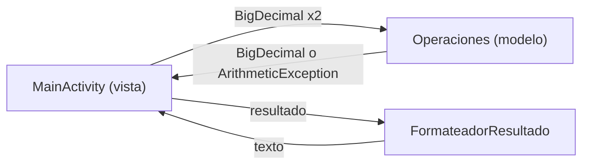

<div align="center">
  
  <h1>CalculaYa</h1>
  <p><b>Calculadora Android de dos operandos con aritmética decimal exacta (BigDecimal).</b></p>
  
  
  
  
  
  <p>
    <a href="#-inicio-rápido">Inicio rápido</a> ·
    <a href="#-características">Características</a> ·
    <a href="#-arquitectura">Arquitectura</a> ·
    <a href="#-pruebas">Pruebas</a> ·
    <a href="#-lo-que-todavía-no-existe">Limitaciones</a>
  </p>
</div>

CalculaYa es una app Android en Java que recibe **dos operandos** y aplica **una operación a la vez**:
suma, resta, multiplicación, división, módulo y potencia. **No** es una calculadora de expresiones
encadenadas (sin paréntesis ni precedencia) y no guarda historial.

## 🎬 Vista rápida

No hay capturas: la app no se pudo ejecutar aquí (no hay emulador). Flujo de uso, tal como lo implementa `MainActivity`:

```text
Valor 1: 0.1        Valor 2: 0.2
[ + ] [ - ] [ × ] [ ÷ ] [ % ] [ ^ ]      [ Limpiar ]

Pulsar "+"  ->  Resultado: 0.3
Valor 2: 0  y pulsar "÷"  ->  Resultado: Error
Campo vacío  ->  aviso "Por favor, ingrese ambos valores"
```

## ✨ Características

| Característica | Detalle |
|---|---|
| Suma, resta, multiplicación | Aritmética decimal exacta con `BigDecimal` (`0.1 + 0.2 = 0.3`). |
| División | Precisión interna de 34 dígitos (`DECIMAL128`); se muestran 15 cifras significativas. División por cero muestra `Error`. |
| Módulo | Resto con el signo del dividendo (`-7 % 3 = -1`), exacto con decimales. Módulo por cero muestra `Error`. |
| Potencia | Exponentes enteros con \|n\| ≤ 999: exactos con `BigDecimal`. Fraccionarios o mayores: `Math.pow` (precisión de `double`). `0^-1`, base negativa con exponente fraccionario y desbordes muestran `Error`. |
| Formato | Sin ceros sobrantes; notación científica fuera del rango de exponente −7 a 15. |
| Limpiar | Vacía ambos campos y el resultado. |
| Rotación | El texto del resultado se guarda en `onSaveInstanceState` (no verificado en un dispositivo real). |

## 🏗️ Arquitectura



`Operaciones` y `FormateadorResultado` no dependen de Android, por eso se prueban con JUnit en la JVM.

<details>
<summary>Estructura de carpetas</summary>

```text
app/src/main/java/com/example/
  modelo/Operaciones.java            Motor aritmético (BigDecimal)
  modelo/FormateadorResultado.java   Resultado -> texto
  vista/MainActivity.java            Pantalla única
app/src/test/java/com/example/modelo/OperacionesTest.java   JUnit 4
app/src/androidTest/                 Solo el ExampleInstrumentedTest de plantilla
.github/workflows/ci.yml             Pruebas + APK debug
```

</details>

## 🚀 Inicio rápido

| Requisito | Versión (según la configuración del proyecto) |
|---|---|
| Android Gradle Plugin | 8.13.2 |
| `compileSdk` / `targetSdk` / `minSdk` | 36 / 36 / 24 |
| JDK | 17 (el que usa el CI); el código compila con nivel Java 11 |
| Android SDK | Requerido (Android Studio lo instala) |

1. Clona el repositorio (rama por defecto: `master`).
2. Ábrelo en Android Studio y ejecútalo en un emulador o dispositivo, o compila desde consola:

```bash
git clone https://github.com/Luiss2080/CalculaYa.git
cd CalculaYa
./gradlew :app:assembleDebug      # APK en app/build/outputs/apk/debug/
```

No pude ejecutar el build en este entorno; los comandos son los que usa el workflow de CI.

## 🧪 Pruebas

```bash
./gradlew :app:testDebugUnitTest
```

Hay **15** pruebas JUnit 4 (`OperacionesTest`) sobre la lógica aritmética y el formateo. La interfaz
(`MainActivity`) no tiene pruebas. El workflow `ci.yml` corre las pruebas y compila el APK debug; su
última ejecución registrada (en un pull request) terminó en éxito.

## 🚧 Lo que todavía no existe

- Solo dos operandos por operación: sin paréntesis, precedencia, encadenado ni historial.
- El teclado del sistema deja escribir `-` o `.` solos: se muestra un aviso de entrada inválida.
- Resultados con 15 cifras significativas; magnitudes muy grandes o pequeñas usan notación científica.
- Sin pruebas de interfaz ni instrumentadas reales (solo la plantilla).
- Textos en español escritos directamente en el código, sin internacionalización.
- **CI:** el workflow solo se dispara en `push` a la rama `main` y en pull requests, pero la rama por
  defecto es `master`; los push directos a `master` no lanzan el CI.

## 📄 Licencia

Sin licencia definida: todos los derechos reservados por defecto.

<div align="center">
  <sub>Hecho por Luiss2080 · Calculadora BigDecimal para Android</sub>
</div>
